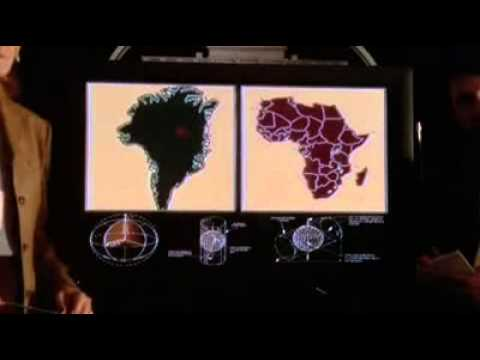

# GIS and GDS

.center[


Table taken from Robin Lovelace's post [Can Geographic Data Save the World?](https://www.robinlovelace.net/2017/05/02/can-geographic-data-save-the-world/).

]

---

# R-Spatial Ecosystem

.pull-left[

**Data I/O, Wrangling, Analysis**

- [sp](https://github.com/edzer/sp/): Classes and Methods for Spatial Data
- [sf](https://github.com/r-spatial/sf): Simple Features for R (builds on sp)
- [spdep](https://github.com/r-spatial/spdep): Spatial Dependence: Weighting Schemes, Statistics, and Models
- [lwgeom](https://github.com/r-spatial/lwgeom): Binding to the liblwgeom library
- ...
]

.pull-right[

**Geographic Data Visualization**

- [ggplot2](https://github.com/tidyverse/ggplot2): An implementation of the Grammar of Graphics in R (as of version 3, I believe)
- [mapview](https://github.com/r-spatial/mapview): Interactive viewing of spatial data in R
- [mapedit](https://github.com/r-spatial/mapedit): Interactive editing of spatial data in R (still in development)
- [leaflet](https://rstudio.github.io/leaflet/): Create Interactive Web Maps with the JavaScript 'Leaflet' Library (great with shiny apps!)
- [tmap](https://github.com/mtennekes/tmap): R package for thematic maps
- ...
]

**People to Follow:** Jakub Nowosad, Robin Lovelace, Edzer Pebesma, Jannes Muenchow, Mark Padgham, Angela Li, Michael Sumner, Leah Wasser, Zev Ross, Kyle Walker, Roger Bivand, Jesse Sadler, and many, many more!
---

# Spatial (vector) data in R

.center[


Image taken from [Geocomputation with R](https://geocompr.robinlovelace.net/spatial-class.html)
]

---

class: center, middle

# Making a map of honeybee permits

**Objectives:** Importing shapefiles, leaflet for interactive maps, popups


---

# Getting the data

1. Go to [Open Minneapolis](http://opendata.minneapolismn.gov/datasets/honey-bee-permits-2017?geometry=-93.528%2C44.925%2C-93.27%2C45.01) to get the shapefile (most common spatial data filetype).

2. Unzip it into a subfolder of the folder your RMarkdown is in called **shp**. 

```
r-ladies/
  - practice.rmd
  -shp/
    -shapefile (collection of a few files)
```

3. Read it into R 

```{r message = FALSE, warning = FALSE}
#install.packages("sf")
library(sf)
honeybee <- st_read("shp/Honey_Bee_Permits_2017.shp")
```

---

#About sf Dataframes

The biggest difference between sf data and regular tidy data is that sf objects have a list of the coordinates for each geometry in a column. 

We will use only sf dataframes, but not every spatial package works with sf. If you ever need a Spatial* object, you can use `as(sf_data, Class = "Spatial")` to convert.

There are a few special properties of sf data, though!

```{r}
str(honeybee$geometry) # what geometry type is your data

# st_geometry(honeybee) gives the geometry type of each feature in a vector

st_crs(honeybee) # coordinate reference system (projection). important!!
```

---

# Projections, continued

We want our data to be projected in UTM 15N (Universal Transverse Mercator Zone 15 North), an appropriate projection for Minnesota. If projections are new to you, read about them in [Geocomputation with R](https://geocompr.robinlovelace.net/spatial-class.html#crs-intro). They're essentially how we translate 3D data (a globe) onto a 2D surface (a map). 

```{r}
honeybee_utm <- st_transform(honeybee, 26915) 
# use epsg codes to specify a projection
```

.pull-left[

  ]
  
.pull-right[

]

---

## Putting it on a map

```{r fig.width=6, fig.height=4.5}
library(mapview)
mapview(honeybee_utm)
```


---

## Map by **HiveType**

```{r fig.width=6, fig.height=4.5}
library(mapview)
mapview(honeybee, zcol = "HiveType", legend = TRUE)
```

---

## Specify the colors

```{r fig.width=6, fig.height=4.5}
library(mapview)
mapview(honeybee, zcol = "HiveType", 
        legend = TRUE, col.regions = c("#4e8e3e", "#34add6"))
```

---

## Simplify the popup

```{r fig.width=6, fig.height=4.5}
library(mapview)
mapview(honeybee, zcol = "HiveType", 
        legend = TRUE, col.regions = c("#4e8e3e", "#34add6"),
        popup = popupTable(honeybee %>% st_set_geometry(NULL), zcol = c("Address", "HiveType")))
```